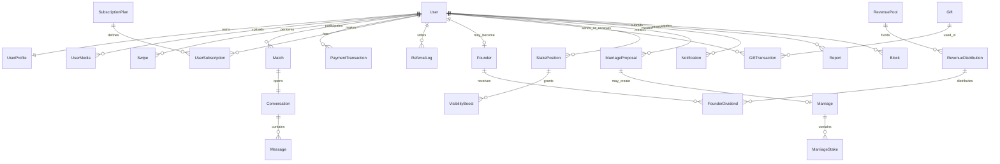

# LYNK — Premium Web3 Dating Platform

LYNK is a premium dating and relationship platform for the global African diaspora, designed around verified profiles, intentional matching, real-time chat, Pi-powered commitment features, founder rewards, and production-grade security foundations.

> **Connect. Grow. Create.**

## Product vision

LYNK treats dating as the entry point into a broader social discovery platform:

```text
Dating → Social Discovery → Communities → Events → Pi Economy → African Social Super App
```

The current repository contains a NestJS backend and Expo React Native frontend. The recent production-hardening work focused on making the existing foundations safer before adding additional marketplace/community/event features.

## Current production-hardening status

Implemented foundations include:

- strict backend environment validation with no JWT secret fallbacks;
- TypeORM migrations-first posture with `DB_SYNCHRONIZE=false` by default;
- persisted, hashed refresh-token rotation with revocation and reuse detection;
- RBAC/admin endpoints with audit logs;
- payment provider abstraction with secure stubs for providers not integrated yet;
- server-side Pi payment verification path;
- idempotent webhook logging;
- Founder allocation protected by PostgreSQL advisory locks;
- revenue-sharing dry-run/idempotency foundations;
- request correlation IDs and production-safe error responses;
- backend healthcheck and observability hooks;
- GitHub Actions CI for backend and frontend validation.

See [`PRODUCTION_READINESS_REPORT.md`](./PRODUCTION_READINESS_REPORT.md) for the current score, remaining risks, and launch checklist.

## Simplified domain model



## Technology stack

| Layer | Technology |
| --- | --- |
| Mobile frontend | Expo, React Native, Expo Router, TypeScript, React Query, Zustand, Reanimated |
| Backend | NestJS, TypeScript, TypeORM, class-validator, Socket.IO |
| Database/cache | PostgreSQL 15+, Redis 7 |
| Jobs/schedules | `@nestjs/schedule`; BullMQ-ready structure |
| Media | AWS S3 with Cloudflare CDN-ready configuration |
| AI | OpenAI-ready service layer for coach, bios, ice-breakers and moderation helpers |
| Payments | Pi provider plus Moneroo/AvadaPay/Coinbase Commerce secure stubs pending real integration |
| Observability | Healthcheck, request IDs, PostHog/Sentry-ready services |
| CI/CD | GitHub Actions with backend lint/build/test/migrations and frontend install/typecheck/lint |

## Repository layout

```text
backend/      NestJS API, TypeORM entities, migrations, services and tests
frontend/     Expo Router mobile app and frontend service layer
docs/         Phase-by-phase production-readiness notes
docker-compose.yml
README.md
SECURITY.md
DEPLOYMENT.md
ENVIRONMENT.md
PRODUCTION_READINESS_REPORT.md
```

## Quick local setup

### 1. Start infrastructure

```bash
docker-compose up postgres redis -d
```

### 2. Configure backend

```bash
cd backend
cp .env.example .env
# edit .env: replace every placeholder secret and configure ALLOWED_ORIGINS
npm ci
npm run migration:run
npm run start:dev
```

### 3. Configure frontend

```bash
cd frontend
npm ci --legacy-peer-deps
npm run typecheck
npm run start
```

If local `npm ci` is blocked by the registry/proxy for Expo/React Native packages, use GitHub Actions or an unblocked npm network and keep the failure visible instead of bypassing it.

## Validation commands

```bash
cd backend
npm run lint:check
npm run build
npm test -- --runInBand
npm run migration:run
```

```bash
cd frontend
npm ci --legacy-peer-deps
npm run typecheck
npm run lint
npm run doctor
```

## Production documents

- [`ENVIRONMENT.md`](./ENVIRONMENT.md) — required variables and secret rules.
- [`DEPLOYMENT.md`](./DEPLOYMENT.md) — deployment and migration flow.
- [`SECURITY.md`](./SECURITY.md) — security posture and reporting guidance.
- [`PRODUCTION_READINESS_REPORT.md`](./PRODUCTION_READINESS_REPORT.md) — readiness score, completed hardening, remaining risks.
