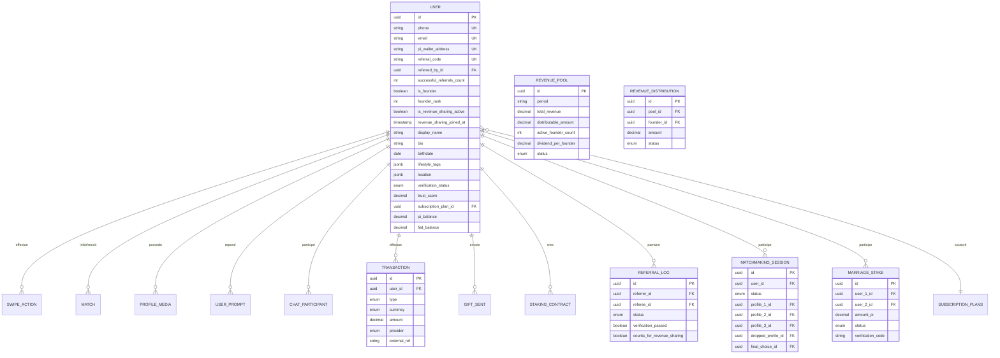

# LYNK – Premium Web3 Dating Application

> **Connect. Grow. Create.**  
> The first Web3 premium dating experience built for the global African diaspora.

---

## 🗺️ Project Overview

Lynk fuses the best of Tinder (swipe), Bumble (first-message rules), Hinge (audio/video prompts), TikTok (discovery feed), and Badoo (lifestyle tags) — layered over a powerful **Pi Network Web3 economy** and an exclusive **Founder Revenue Sharing programme**.

---

## 🧬 Simplified Database Schema



---

## 🏗️ Tech Stack

| Layer | Technology |
|-------|-----------|
| Frontend | React Native (Expo), Expo Router, Reanimated |
| Backend | Node.js + NestJS + TypeORM |
| Database | PostgreSQL 15+ |
| Cache / Pub-Sub | Redis 7 |
| Real-time | Socket.IO (WebSocket) |
| File Storage | AWS S3 + Cloudflare CDN |
| AI | OpenAI GPT-4o-mini (coach, bio, ice-breakers) |
| Verification | AWS Rekognition (liveness detection) |
| Notifications | Firebase Cloud Messaging |
| Payments | Pi Network SDK + Pawapay + Binance Pay |
| Infrastructure | Docker + Docker Compose |

---

## 💳 Supported Payment Architecture

Lynk supports exactly three payment modes:

- **Pi Network** — Pi wallet authentication, Pi payment verification, staking and Web3 economy flows.
- **Pawapay** — Mobile Money payment rail for supported African markets.
- **Binance Pay** — Crypto payment rail for international settlement and merchant-style payments.

Removed payment targets are not part of the active product architecture.

---

## 📁 Project Structure

```
lynk/
├── backend/                  # NestJS API
│   ├── src/
│   │   ├── common/           # Enums, constants, guards, decorators
│   │   ├── config/           # App & TypeORM configuration
│   │   └── modules/
│   │       ├── auth/         # JWT, OAuth, Pi Wallet auth
│   │       ├── user/         # User entity & profile management
│   │       ├── profile/      # Media upload, prompts, AI bio
│   │       ├── verification/ # AWS Rekognition liveness + KYC
│   │       ├── matchmaking/  # Swipe engine, AI Matchmaker
│   │       ├── chat/         # WebSocket chat, E2E encryption
│   │       ├── payment/      # Pi Network, Pawapay, Binance Pay
│   │       ├── subscription/ # Plans seeding & management
│   │       ├── referral/     # Referral + monthly revenue distribution
│   │       ├── staking/      # Anti-ghosting date staking
│   │       ├── marriage/     # Marriage Stake Web3 contract
│   │       ├── gift/         # Virtual gift catalogue
│   │       ├── ai/           # OpenAI service
│   │       ├── s3/           # AWS S3 uploads
│   │       └── notification/ # Firebase FCM
│   ├── Dockerfile
│   └── .env.example
│
├── frontend/                 # React Native (Expo)
│   ├── app/
│   │   ├── index.tsx         # Route guard (auth → onboarding → home)
│   │   ├── auth/             # welcome, login, register, onboarding
│   │   ├── home/             # Swipe deck
│   │   ├── chat/             # Chat list + room
│   │   ├── profile/          # Profile view
│   │   └── referral/         # Founder dashboard
│   └── src/
│       ├── components/ui/    # GlassCard, NeonButton, GradientText, Badges
│       ├── constants/        # theme.ts, api.ts
│       ├── providers/        # AuthProvider
│       └── services/         # Axios API client with JWT refresh
│
└── docker-compose.yml
```

---

## 🚀 Getting Started

### Prerequisites
- Node.js ≥ 22
- Docker & Docker Compose

### 1. Start infrastructure

```bash
docker-compose up postgres redis -d
```

### 2. Configure backend

```bash
cd backend
cp .env.example .env
# Fill in your secrets
npm install
npm run start:dev
```

Swagger docs: `http://localhost:3000/api/docs`

### 3. Configure frontend

```bash
cd frontend
cp .env.example .env
npm install
npx expo start
```

---

## 🌟 Key Business Rules

### Founder Programme
- The **first 2500 users** to register are automatically assigned `isFounder = true` and a unique `founderRank` (1–2500).
- This status is **permanent** and **cannot be purchased**.
- A Founder activates **Revenue Sharing** once they have referred **5 verified users** (i.e., users who passed AI liveness verification).

### Monthly Revenue Distribution (Cron Job)
```
Runs: 1st of every month at 02:00 UTC
Pool: 5% of prior month's subscription + boost + gift revenue
Recipients: All Founders where isRevenueSharingActive = true
Method: Transactional DB update → no double payments
```

### Anti-Ghosting Smart Contract
- Both parties stake equal Pi for an IRL date.
- Confirmation window: ±1 hour around the scheduled date time (geolocation-based).
- If both confirm → stakes returned.
- If one ghosts → victim receives both stakes.

### AI Matchmaker (Platinum Only)
- Quarterly allocation: 1 session per quarter.
- Flow: 3 AI-selected profiles → user eliminates 1 after discussion → final choice from remaining 2 → auto-match.

---

## 🎨 Design Tokens

```typescript
COLORS = {
  background: '#0A0A0A',
  surface: '#1A1A2E',
  primaryViolet: '#6C3BFF',
  electricBlue: '#00C2FF',
  neonPink: '#FF4FD8',
  gold: '#FFD700',
}
```

UI style: **Dark Premium Glassmorphism** — blur cards, neon borders, smooth Reanimated animations, Poppins/Sora typography.

---

## 📌 Environment Secrets Required

| Secret | Purpose |
|--------|---------|
| `JWT_ACCESS_SECRET` | JWT signing |
| `OPENAI_API_KEY` | AI coach + bio + moderation |
| `AWS_ACCESS_KEY_ID` / `AWS_SECRET_ACCESS_KEY` | S3 uploads + Rekognition |
| `FIREBASE_*` | Push notifications |
| `PI_API_KEY` | Pi Network auth & payments |
| `PAWAPAY_API_KEY` | Pawapay Mobile Money payments |
| `BINANCE_PAY_API_KEY` | Binance Pay crypto payments |

Set these in your `.env` file or as Docker environment variables.
